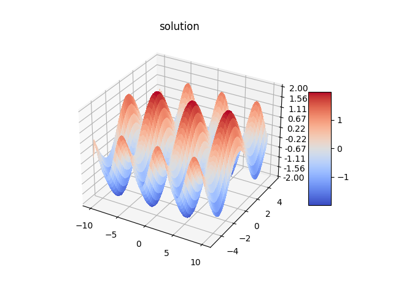
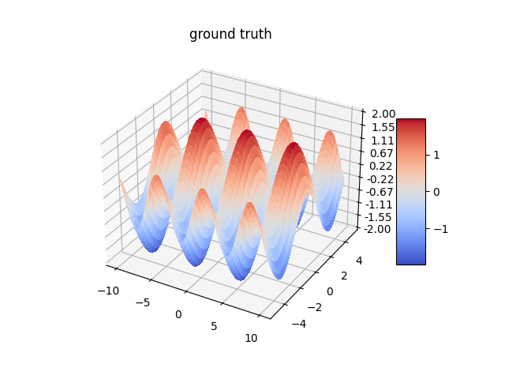

# poissonpy
Plug-and-play library for solving 2D Poisson equations. Useful tool in scientific computing prototyping, image and video processing, computer graphics.

## Features
- Solve the Poisson equation on sqaure or non-square rectangular grids.
- Solve the Poisson equation on regions with arbitrary shape.
- Define arbitrary boundary and interior conditions using `sympy` function experssions or `numpy` arrays.
- Define Dirichlet, Neumann, or mixed boundary conditions.

## Usage 

Import necessary libraries. `poissonpy` utilizes `numpy` and `sympy` greatly, so its best to import both:

```python
import numpy as np
from sympy import sin, cos
from sympy.abc import x, y

import poissonpy
```

Define functions using `sympy` function expressions or numpy arrays:

```python
f_expr = sin(x) + cos(y)
laplacian_expr = diff(f_expr, x, 2) + diff(f_expr, y, 2)

f = poissonpy.get_2d_sympy_function(f_expr)
laplacian = poissonpy.get_2d_sympy_function(laplacian_expr)
```

Define interior and boundary conditions:

```python
interior = laplacian
boundary = {
    "left": (f, "dirichlet"),
    "right": (f, "dirichlet"),
    "top": (f, "dirichlet"),
    "bottom": (f, "dirichlet")
}
```

Initialize solver and solve Poisson equation:

```python
solver = Poisson2DRectangle(
        ((-10, -5), (10, 5)), interior, boundary, X=100, Y=100)
solution = solver.solve()
```

Plot solution and ground truth:
```
poissonpy.plot_3d(solver.x_grid, solver.y_grid, solution)
poissonpy.plot_3d(solver.x_grid, solver.y_grid, f(solver.x_grid, solver.y_grid))
```
|Solution|Ground truth|
|--|--|
|||
