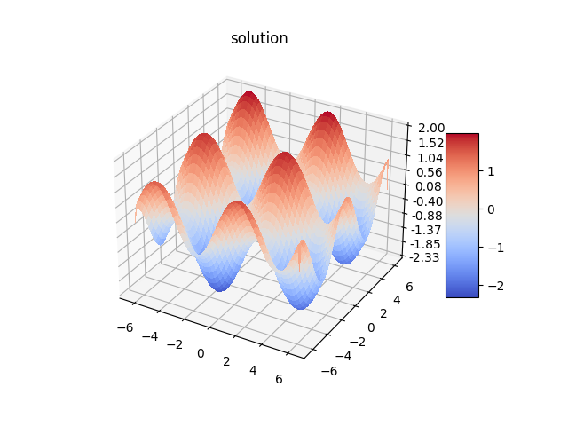
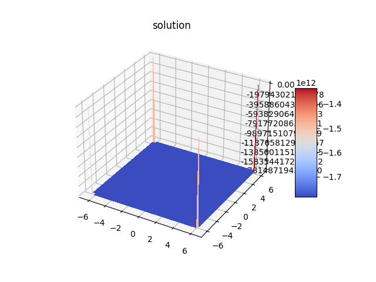
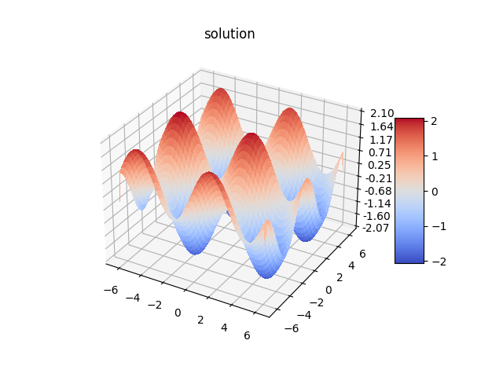

# poissonpy
Plug-and-play standalone library for solving 2D Poisson equations. Useful tool in scientific computing prototyping, image and video processing, computer graphics.

## Features
- Solves the Poisson equation on sqaure or non-square rectangular grids.
- Solves the Poisson equation on regions with arbitrary shape.
- Supports arbitrary boundary and interior conditions using `sympy` function experssions or `numpy` arrays.
- Supports Dirichlet, Neumann, or mixed boundary conditions.

## Disclaimer
This package is only used to solve 2D Poisson equations. If you are looking for a general purpose and optimized PDE library, you might want to checkout the [FEniCSx project](https://fenicsproject.org/index.html).

## Usage 
Import necessary libraries. `poissonpy` utilizes `numpy` and `sympy` greatly, so its best to import both:

```python
import numpy as np
from sympy import sin, cos
from sympy.abc import x, y

from poissonpy import functional, utils, sovlers
```

### Defining `sympy` functions
In the following examples, we use a ground truth function to create a mock Poisson equation and compare the solver's solution with the analytical solution. 
   
Define functions using `sympy` function expressions or `numpy` arrays:

```python
f_expr = sin(x) + cos(y) # create sympy function expression
laplacian_expr = functional.get_sp_laplacian_expr(f_expr) # create sympy laplacian function expression

f = functional.get_sp_function(f_expr) # create sympy function
laplacian = functional.get_sp_function(laplacian_expr) # create sympy function
```

### Dirichlet Boundary Conditions
Define interior and Dirichlet boundary conditions:

```python
interior = laplacian
boundary = {
    "left": (f, "dirichlet"),
    "right": (f, "dirichlet"),
    "top": (f, "dirichlet"),
    "bottom": (f, "dirichlet")
}
```

Initialize solver and solve Poisson equation:

```python
solver = Poisson2DRectangle(((-2*np.pi, -2*np.pi), (2*np.pi, 2*np.pi)), 
    interior, boundary, X=100, Y=100)
solution = solver.solve()
```

Plot solution and ground truth:
```python
poissonpy.plot_3d(solver.x_grid, solver.y_grid, solution)
poissonpy.plot_3d(solver.x_grid, solver.y_grid, f(solver.x_grid, solver.y_grid))
```

|Solution|Ground truth|Error|
|--|--|--|
||||

### Neumann Boundary Conditions
You can also define Neumann boundary conditions by specifying `neumann_x` and `neumann_y` in the boundary condition parameter.

```python

x_derivative_expr = functional.get_sp_derivative_expr(f_expr, x)
y_derivative_expr = functional.get_sp_derivative_expr(f_expr, y)

interior = laplacian
boundary = {
    "left": (f, "dirichlet"),
    "right": (functional.get_sp_function(x_derivative_expr), "neumann_x"),
    "top": (f, "dirichlet"),
    "bottom": (functional.get_sp_function(y_derivative_expr), "neumann_y")
}
```

|Solution|Ground truth|Error|
|--|--|--|
||||

### Zero-mean solution
If the boundary condition is purely Neumann, then the solution is not unique. Naively solving the Poisson equation gives bad results. In this case, you can set the `zero_mean` paramter to `True`, such that the solver finds a zero-mean solution. 

```python
solver = solvers.Poisson2DRectangle(
    ((-2*np.pi, -2*np.pi), (2*np.pi, 2*np.pi)), interior, boundary, 
    X=100, Y=100, zero_mean=True)
```

|`zero_mean=False`|`zero_mean=True`|Ground truth|
|--|--|--|
||||

### Laplace Equation
It's also straightforward to define a Laplace equation - **we simply set the interior laplacian value to 0**. In the following example, we set the boundary values to be spatially-varying periodic functions.

```python
interior = 0 # laplace equation form
left = poissonpy.get_2d_sympy_function(sin(y))
right = poissonpy.get_2d_sympy_function(sin(y))
top = poissonpy.get_2d_sympy_function(sin(x))
bottom = poissonpy.get_2d_sympy_function(sin(x))

boundary = {
    "left": (left, "dirichlet"),
    "right": (right, "dirichlet"),
    "top": (top, "dirichlet"),
    "bottom": (bottom, "dirichlet")
}
```

Solve the Laplace equation:

```python
solver = Poisson2DRectangle(
    ((-2*np.pi, -2*np.pi), (2*np.pi, 2*np.pi)), interior, boundary, 100, 100)
solution = solver.solve()
poissonpy.plot_3d(solver.x_grid, solver.y_grid, solution, "solution")
poissonpy.plot_2d(solution, "solution")
```

|3D surface plot|2D heatmap|
|--|--|
|||

### Arbitrary-shaped domain
Use the `Poisson2DRegion` class to solve the Poisson eqaution on a arbitrary-shaped function domain. `poissonpy` can be seamlessly integrated in gradient-domain image processing algorithms.
   
The following is an example where `poissonpy` is used to implement the image cloning algorithm proposed in [Poisson Image Editing](https://www.cs.jhu.edu/~misha/Fall07/Papers/Perez03.pdf) by Perez et al., 2003. See `examples/poisson_image_editing.py` for more details. 

```python
# compute laplacian of interpolation function
Gx_src, Gy_src = functional.get_np_gradient(source)
Gx_target, Gy_target = functional.get_np_gradient(target)
G_src_mag = (Gx_src**2 + Gy_src**2)**0.5
G_target_mag = (Gx_target**2 + Gy_target**2)**0.5
Gx = np.where(G_src_mag > G_target_mag, Gx_src, Gx_target)
Gy = np.where(G_src_mag > G_target_mag, Gy_src, Gy_target)
Gxx, _ = functional.get_np_gradient(Gx, forward=False)
_, Gyy = functional.get_np_gradient(Gy, forward=False)
laplacian = Gxx + Gyy
    
# solve interpolation function
solver = solvers.Poisson2DRegion(mask, laplacian, target)
solution = solver.solve()

# alpha-blend interpolation and target function
blended = mask * solution + (1 - mask) * target
```

<p align="center">
    
</p>

Another example of using `poissonpy` to implement flash artifacts and reflection removal, using the algorithm proposed in [Removing Photography Artifacts using Gradient Projection and Flash-Exposure Sampling](http://www.cs.columbia.edu/cg/pdfs/114-flashReflectionsRaskarSig05.pdf) by Agrawal et al. 2005. See `examples/flash_noflash.py` for more details.

```python
Gx_a, Gy_a = functional.get_np_gradient(ambient)
Gx_f, Gy_f = functional.get_np_gradient(flash)

# gradient projection
t = (Gx_a * Gx_f + Gy_a * Gy_f) / (Gx_a**2 + Gy_a**2 + 1e-8)
Gx_f_proj = t * Gx_a
Gy_f_proj = t * Gy_a

# compute laplacian (div of gradient)
lap = functional.get_np_div(Gx_f_proj, Gy_f_proj)

# integrate laplacian field
solver = solvers.Poisson2DRegion(mask, lap, flash)
res = solver.solve()
```

<p align="center">
    
</p>

<p align="center">
    
</p>